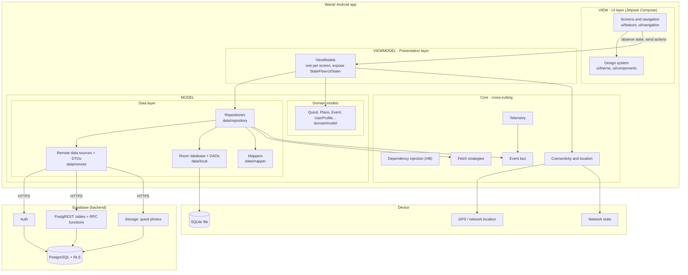
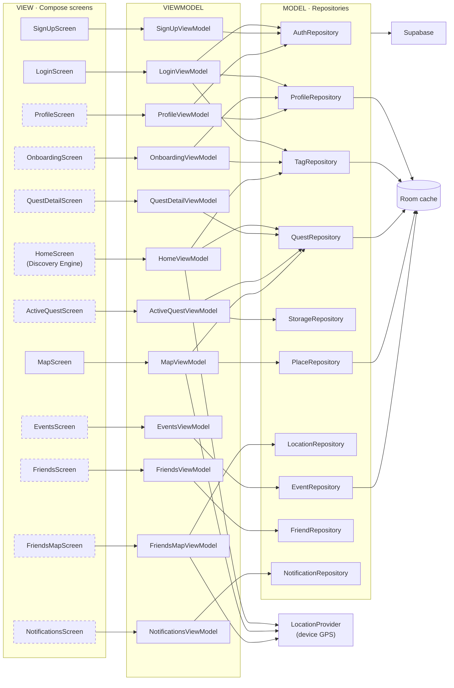
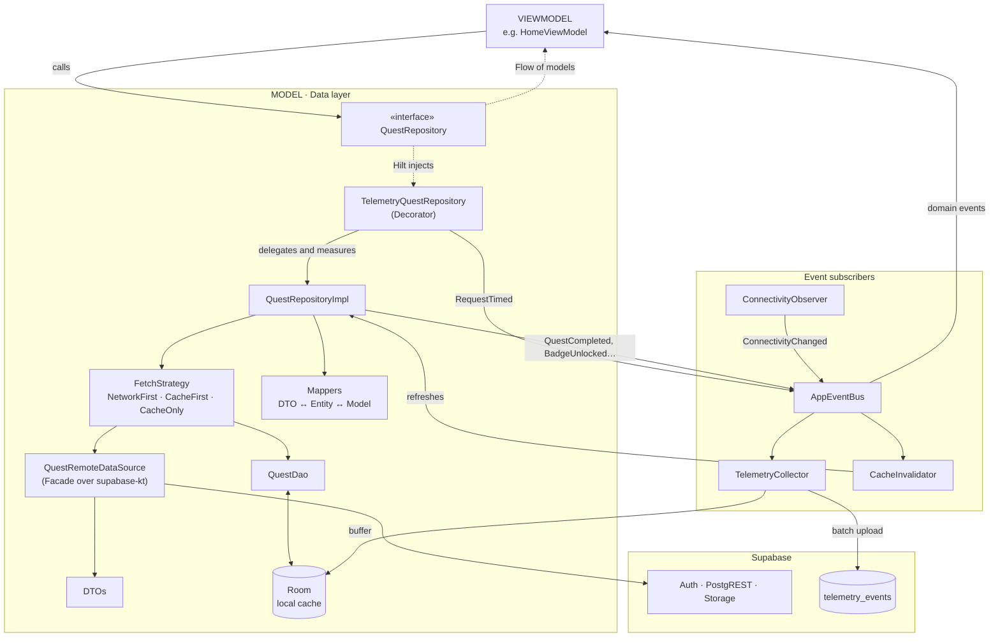
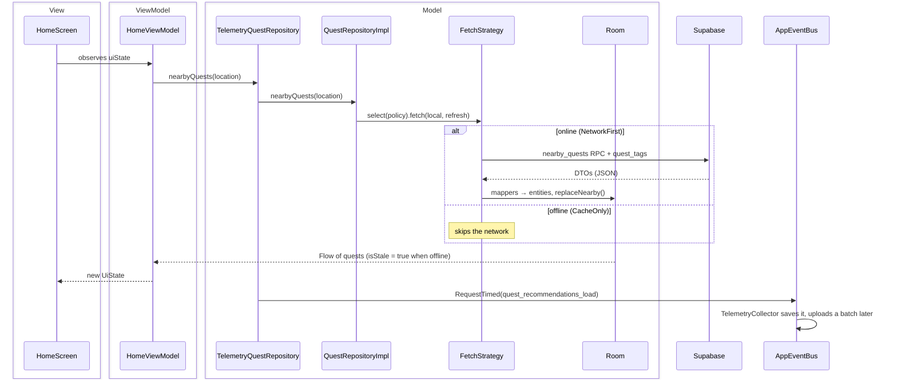
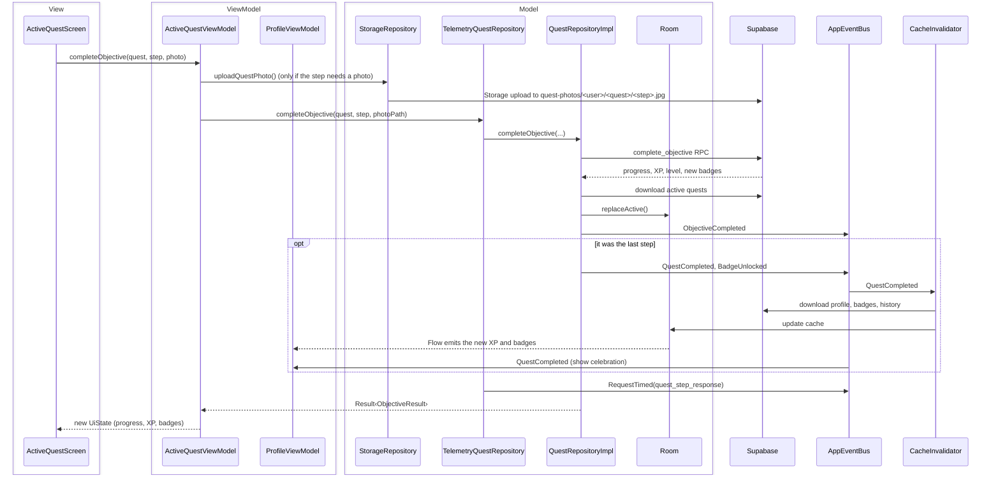
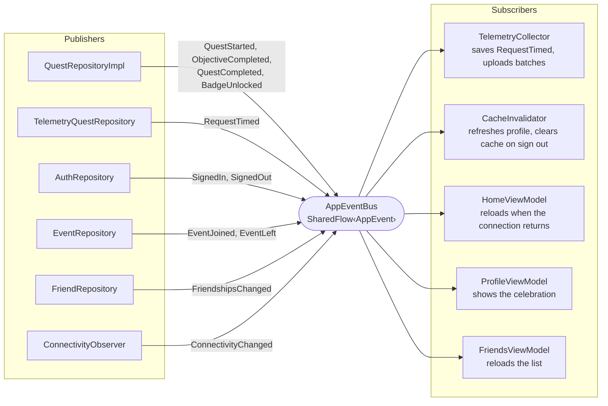
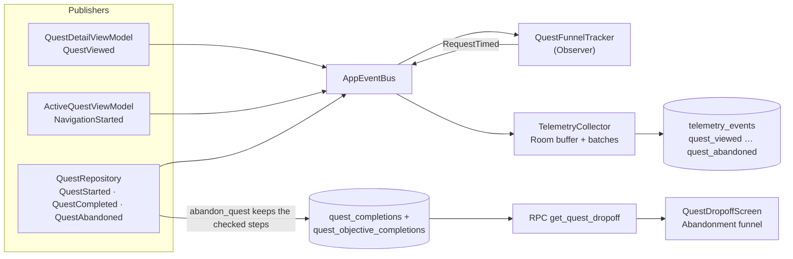

# 3. Architectural Design

This document describes the architecture of the Wandr Android app (Kotlin, Jetpack Compose). The backend is Supabase and is documented in the `ISIS3510-Moviles-Group32` repository.

## Architecture - Overall System Structure and Components

### Diagram 1: Layers and external systems



**Rationale:** The app follows MVVM, and its three parts are layers with one-way dependencies: View → ViewModel → Model. Each one only knows the one below it.

- **View:** the Compose screens, the navigation graph and the design system. It draws the state and reports what the user does.
- **ViewModel:** one per screen. It holds the screen's state (`UiState`) and decides what to ask the Model for.
- **Model:** the domain models plus the data layer (repositories, Supabase data sources, Room). It owns the data and the access to it.

- **Why this separation:** a screen never talks to Supabase or Room. It only renders the state of its ViewModel. This lets the team build screens and data access in parallel, and lets us test the logic without a device (58 unit tests run on the JVM).
- **Why MVVM:** it is the pattern Google recommends for Compose. The ViewModel survives screen rotation and holds the state, so the UI is a pure function of that state.
- **Why a data layer with two sources:** the quality scenarios require the app to keep working without a connection (QS1) and to keep quest progress (QS8). The data layer hides whether the data comes from Supabase or from the local Room cache.
- **Why Supabase as the whole backend:** it already provides login, a REST API over PostgreSQL, storage and row-level security. The team does not need to run its own server. Business rules that must not be bypassed, such as XP, badges and event capacity, run in the database as RPC functions.
- **Why a `core` module:** injection, events, connectivity, location and telemetry are used by several features. Keeping them in one place avoids duplicating them in every feature.

### Diagram 2: MVVM components per screen

Solid boxes in the View column are built. Dashed boxes are planned screens whose ViewModel already exists.



**Rationale:** This diagram shows the MVVM rule applied to every feature: one View, one ViewModel, and only the repositories that screen needs.

- **One ViewModel per screen:** each screen has its own state and its own reasons to change. A shared "god" ViewModel would make every screen depend on every repository.
- **ViewModels never talk to each other:** when two screens care about the same thing, they share a repository (the data) or hear the same event (see Diagram 6). For example, `LoginViewModel` and `ProfileViewModel` both use `ProfileRepository`.
- **Repositories are split by domain, not by screen:** `QuestRepository` serves three screens (Home, Quest Details, Active Quest). The logic for quests exists once.
- **Only five repositories use the Room cache:** profile, tags, quests, places and events are what the user must see offline (QS1, QS8). Friends, notifications and the friends map are live data, so they always come from Supabase.
- **Location is a device service, not a repository:** `LocationProvider` reads the GPS. Only the three screens that need the user's position depend on it.

### Diagram 3: Components of the data layer

This diagram zooms into one repository of Diagram 2. It uses quests as the example. The other domains (profile, places, events, friends, notifications) follow the same shape.



**Rationale:** Each component has one job, so a change in one place does not spread.

- **Repository interface:** ViewModels depend on `QuestRepository`, not on its implementation. Tests replace it with a fake, and Hilt can hand out a decorated version without the ViewModel noticing.
- **Remote data source:** it is the only place that imports `supabase-kt`. If the SDK or an endpoint changes, only this class changes.
- **DTOs and mappers:** DTOs copy the backend's JSON exactly. Mappers translate them to Room entities and to domain models. A renamed column is fixed in one mapper instead of in every screen.
- **Room as the single source of truth:** reads always come from Room. The network only refreshes Room. This gives one code path for online and offline, and the UI updates by itself when the cache changes.
- **Decorator for telemetry:** only quests have business-question metrics (BQ1, BQ2), so only `QuestRepository` is wrapped. The real repository has no timing code.
- **Event bus:** refreshing the profile after a quest and saving telemetry are side effects. They live in subscribers, so the quest repository does not need to know about profiles or telemetry.

## Architecture Design - Component Interaction and Communication
| Pattern / style | Where | Why |
| --- | --- | --- |
| **MVVM** | `ui/feature/**/XViewModel.kt` | Screens only render a `UiState` and call functions. All the logic can be tested without Android UI. |
| **Repository** | `data/repository/` | One interface per domain. ViewModels depend on the interface, never on Supabase or Room. |
| **DTO** | `data/remote/dto/` | Each class mirrors a Supabase response exactly (`@SerialName("snake_case")`). Postgres enums stay as `String`, so a new backend value cannot break decoding. |
| **DAO** | `data/local/dao/` | All local SQL lives in Room DAOs. Queries return `Flow`, and multi-step writes use `@Transaction`. |
| **Mapper (Adapter)** | `data/mapper/` | Converts DTO → Entity → domain model. If a column changes, only the mapper changes. |
| **Facade** | `data/remote/datasource/*RemoteDataSource` | Hides the `supabase-kt` query builder behind simple methods such as `nearbyQuests(lat, lng, radius)`. Only these classes import Supabase. |
| **Strategy** | `core/strategy/` | `NetworkFirst`, `CacheFirst` and `CacheOnly` are interchangeable. `StrategySelector` switches to `CacheOnly` when there is no connection. Repositories do not repeat this logic. |
| **Decorator** | `data/repository/TelemetryQuestRepository.kt` | Wraps the real `QuestRepository` (`by inner`) and measures BQ1 (`nearbyQuests`) and BQ2 (`completeObjective`) without touching its code. Hilt hands out the decorated instance (`RepositoryModule`). |
| **Observer** | Room `Flow` → Repository → ViewModel | When Room changes, every screen that shows that data updates automatically. |
| **Observer (BQ8 funnel)** | `core/analytics/QuestFunnelTracker.kt` | Subscribes to `QuestViewed`, `QuestStarted`, `NavigationStarted`, `QuestCompleted` and `QuestAbandoned` and records each one as a funnel row in `telemetry_events`. The screens and the repository only publish; they do not know the tracker exists. |
| **Event-based** | `core/event/AppEventBus.kt` | Publishers (repositories, the Decorator, connectivity) and subscribers (`TelemetryCollector`, `CacheInvalidator`, ViewModels) do not know each other. |
| **Singleton + Dependency Injection** | `core/di/` (Hilt) | One `SupabaseClient` (one session) and one `WandrDatabase` for the whole app. Tests pass in fakes. |
| **Layers + single source of truth** | Remote → Room → Repository | Reads always come from Room, so the app shows saved data offline (QS1) and keeps quest progress (QS8). |

### Diagram 4: Reading data (nearby quests)



**Rationale:** This flow answers two quality scenarios and one business question at once.

- **Offline (QS1):** the `StrategySelector` picks `CacheOnly` when there is no connection. The ViewModel receives the saved quests with `isStale = true` and the screen shows "No internet connection. Showing saved activities".
- **Reactive UI:** the ViewModel does not ask "did it finish?". It observes a `Flow` from Room, so any later change in the cache reaches the screen without extra code.
- **BQ1 (response time of recommendations):** the Decorator measures the time until the first real answer and publishes it as an event. The measurement does not slow down the request, because saving it happens in a subscriber.

### Diagram 5: Writing data (checking a quest step)



**Rationale:**

- **Rules on the server:** XP, level, streak and badges are computed inside the `complete_objective` RPC. The app cannot grant itself XP, even if it is modified, because the database rejects direct writes to those columns.
- **Writes return a `Result`:** every failure is mapped to a readable `AppError`. Backend messages such as "This event is full" reach the user as they are. Writes need a connection. Offline, they fail with "No internet connection".
- **Decoupled side effects:** the quest repository only publishes `QuestCompleted`. The `CacheInvalidator` refreshes the profile, and `ProfileViewModel` updates because it observes Room. No component calls another feature directly.
- **BQ2 (slowest quest step):** the Decorator measures each `completeObjective` call with the quest and step ids.

### Diagram 6: Event-based communication



**Rationale:** Some things must happen "whenever X happens", wherever X comes from. A direct call would force every publisher to know every interested component.

- **Loose coupling:** a publisher does not know who listens. Adding a new reaction, for example a push notification when a badge is unlocked, means adding one subscriber and changing no existing code.
- **App-wide subscribers:** `TelemetryCollector` and `CacheInvalidator` start in `WandrApplication` and live as long as the app. Telemetry is not lost when the user leaves a screen.
- **Limit of the bus:** it is only used for notifications. Data still travels through repositories and Room, so there is always one place to read the current state.

## Design Patterns and Tactics

### Design patterns

| Pattern | Where | Problem it solves |
| --- | --- | --- |
| **MVVM** | `ui/feature/**/XViewModel.kt` | Screens only render a `UiState` and call functions. All the logic is testable without Android UI. |
| **Repository** | `data/repository/` | One interface per domain. ViewModels never depend on Supabase or Room. |
| **DTO** | `data/remote/dto/` | Each class mirrors a Supabase response exactly. Postgres enums stay as `String`, so a new backend value cannot break decoding. |
| **DAO** | `data/local/dao/` | All local SQL lives in Room DAOs. Queries return `Flow`, and multi-step writes use `@Transaction`. |
| **Mapper (Adapter)** | `data/mapper/` | Converts DTO → Entity → domain model. If a column changes, only the mapper changes. |
| **Adapter** | `ui/components/map/`, `core/location/` | `WandrMap` and `LocationProvider` are the interfaces the app expects. `GoogleMapAdapter` and `FusedLocationProvider` translate them to the Google SDKs, so changing the map provider does not touch any screen. |
| **Facade** | `data/remote/datasource/` | Hides the `supabase-kt` query builder behind simple methods such as `nearbyQuests(lat, lng, radius)`. |
| **Strategy** | `core/strategy/` | `NetworkFirst`, `CacheFirst` and `CacheOnly` are interchangeable. `StrategySelector` picks one for each request. |
| **Decorator** | `data/repository/TelemetryQuestRepository.kt` | Adds measurement (BQ1, BQ2) around the real repository without changing it. |
| **Observer** | Room `Flow` → Repository → ViewModel → Compose | When data changes, every screen that shows it updates automatically. |
| **Publish-subscribe** | `core/event/AppEventBus.kt` | Publishers and subscribers do not know each other. |
| **Singleton + Dependency Injection** | `core/di/` (Hilt) | One `SupabaseClient` (one session) and one database for the whole app. Tests pass in fakes. |

### Tactics

| Quality attribute | Tactic | Where | Scenario |
| --- | --- | --- | --- |
| Availability | Local cache with fallback: if the network fails, show saved data marked as stale | `FetchStrategy`, Room | QS1 |
| Availability | Detect the fault: observe connectivity and switch strategy before calling the network | `ConnectivityObserver`, `StrategySelector` | QS1 |
| Availability | Degraded mode for location: current fix → last known → center of Bogotá | `LocationProvider` | QS11 |
| Reliability | Persist state: quest progress is saved in Room after every step | `QuestDao` | QS8 |
| Performance | Batch requests: telemetry is sent in groups of 20, or when the app goes to the background | `TelemetryCollector` | BQ1, BQ2 |
| Performance | Reduce requests: tags use `CacheFirst`, and the user search waits 300 ms after the last keystroke | `TagRepository`, `FriendsViewModel` | QS2, QS7 |
| Energy | Location updates only after moving 50 m | `LocationProvider` | QS5 |
| Energy | Poll friends' positions only while the screen is visible | `FriendsMapViewModel` | QS5 |
| Security | Authorize on the server: row-level security and RPC functions; the app only holds a publishable key | Supabase | QS6 |
| Security | Limit exposure: the cache is cleared on sign out; photos go to a private bucket, in a per-user folder | `CacheInvalidator`, `storage.sql` | QS6 |
| Testability | Depend on interfaces and inject fakes | Repositories, Hilt | - |
| Modifiability | Isolate the backend SDK behind facades and mappers | `data/remote`, `data/mapper` | - |

**Rationale:** The patterns and tactics were chosen from the quality scenarios and business questions of Sprint 1, not for their own sake.

- **Offline and persistence (QS1, QS8)** drive the largest decisions: Room as the single source of truth, the Strategy pattern to choose between cache and network, and the Observer pattern so the UI follows the cache.
- **Business questions BQ1 and BQ2** need response times. The Decorator measures them, the event bus carries them and the collector batches them, so measuring does not slow the user down or drain the battery.
- **Modifiability** matters because the backend is still changing. DTOs, mappers and facades confine a backend change to the data layer.
- **Security** is enforced by the backend. The app is treated as untrusted: it can only do what row-level security and the RPC functions allow.

Two limits of the current design:
- **Writes need a connection.** Completing a step offline fails with a message; it is not queued and retried. Scenario QS10 (eventual connectivity) is not covered yet.
- **Friends, notifications and the friends map are not cached**, because they are live data.

## Appendix

### Packages

```
com.kotlin.wandr
├── WandrApplication.kt      Starts the event bus subscribers
├── core/
│   ├── di/                  Hilt modules (Supabase, Room, repositories, device services)
│   ├── error/               AppError, ErrorMapper, safeCall
│   ├── event/               AppEvent, AppEventBus, CacheInvalidator
│   ├── location/            LocationProvider
│   ├── network/             ConnectivityObserver
│   ├── strategy/            FetchStrategy, StrategySelector, Resource
│   └── telemetry/           TelemetryCollector, event names
├── data/
│   ├── local/               WandrDatabase, dao/, entity/
│   ├── mapper/
│   ├── remote/              dto/, datasource/
│   └── repository/          Interfaces + implementations + Decorator
├── domain/model/            Models used by the ViewModels and the UI
└── ui/
    ├── theme/               Design tokens (see DESIGN_SYSTEM.md)
    ├── components/          Reusable composables
    ├── navigation/          Navigation graph
    └── feature/             auth, onboarding, home, quest, map, events, friends, notifications, profile
```

## ViewModel per screen

| Screen | ViewModel | Repositories |
| --- | --- | --- |
| Log in | `LoginViewModel` | Auth, Profile, Tag |
| Sign up | `SignUpViewModel` | Auth |
| Onboarding | `OnboardingViewModel` | Tag, Profile |
| Discovery Engine | `HomeViewModel` | Quest, Tag + LocationProvider |
| Quest Details | `QuestDetailViewModel` + `QuestDetailScreen` | Quest (publishes `QuestViewed`) |
| Active Quest / Navigation | `ActiveQuestViewModel` + `ActiveQuestScreen` | Quest, Storage (publishes `NavigationStarted`) |
| My Quests (in progress) | `ActiveQuestViewModel` + `ActiveQuestsScreen` | Quest |
| Abandonment Funnel (BQ8, internal, debug builds only) | `QuestDropoffViewModel` + `QuestDropoffScreen` | Analytics (`get_quest_dropoff` RPC) |
| Map | `MapViewModel` | Place + LocationProvider |
| Friends on Quest | `FriendsMapViewModel` | Location + LocationProvider |
| Events | `EventsViewModel` | Event |
| Friends | `FriendsViewModel` | Friend |
| Notifications | `NotificationsViewModel` | Notification |
| Profile / Side Quests | `ProfileViewModel` + `ProfileScreen` | Profile (+ `get_streak_summary` RPC for BQ4), Auth |

Every `UiState` has an `errorMessage` that is ready to show, plus an `onErrorShown()` function. Screens that can show cached data also have `isShowingSavedData`.

## BQ8: where users abandon quests

*"In which step do users most frequently abandon a quest without finishing it?"* (Type 3)



- **Answer (for the team):** `get_quest_dropoff()` reads every abandoned quest and the last step that was checked, and the
  Abandonment Funnel screen shows the quest + step with most abandons and the totals per step. BQ8 is Type 3 (features
  analysis), so this screen is an internal tool: it is only reachable from Profile in **debug builds**.
- **For the user:** the same data powers the drop-off hint in Active Quest (smart feature).
- **Funnel events:** `quest_viewed → quest_accepted → navigation_started → quest_completed / quest_abandoned` go to
  `telemetry_events` with `duration_ms` = time since the previous step. They also show the drop-off *before* a quest
  is started (viewed but never accepted). The SQL is in `telemetry.sql` of the backend repo.
- **Progress persistence:** active quests and checked steps live in Room (`activeQuests`), so the tracker keeps the
  progress offline and after the app is closed.

