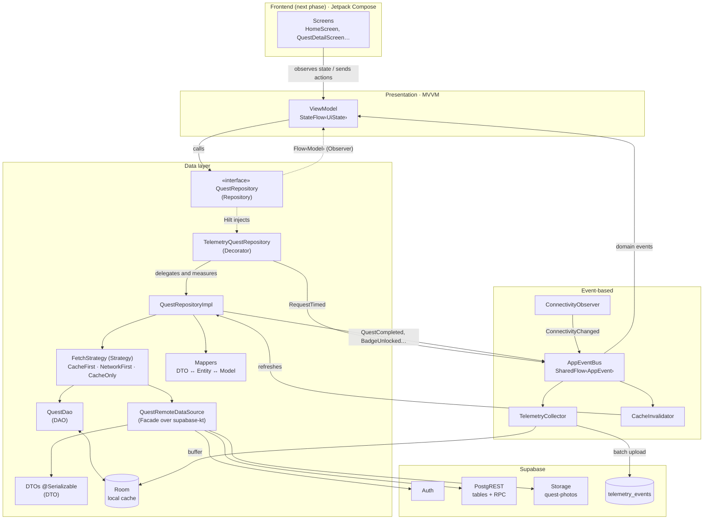
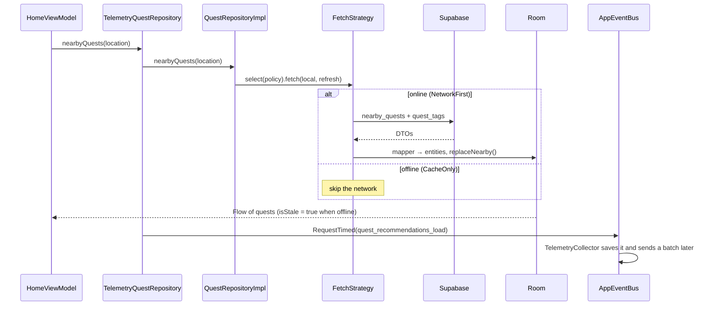

# Wandr Android - Architecture

The app follows **MVVM** with a **Repository** layer on top of two data sources: Supabase (network) and Room (local cache).
Screens are not built yet. The ViewModels are ready and tested, so each screen only has to observe `uiState` and call its functions.

## Overview



The diagram uses quests as the example. The other domains follow the same shape. Only `QuestRepository` has a Decorator, because it is the only one with metrics.

## Patterns and styles

| Pattern / style | Where | Why |
| --- | --- | --- |
| **MVVM** | `ui/feature/**/XViewModel.kt` | Screens only render a `UiState` and call functions. All the logic can be tested without Android UI. |
| **Repository** | `data/repository/` | One interface per domain. ViewModels depend on the interface, never on Supabase or Room. |
| **DTO** | `data/remote/dto/` | Each class mirrors a Supabase response exactly (`@SerialName("snake_case")`). Postgres enums stay as `String`, so a new backend value cannot break decoding. |
| **DAO** | `data/local/dao/` | All local SQL lives in Room DAOs. Queries return `Flow`, and multi-step writes use `@Transaction`. |
| **Mapper (Adapter)** | `data/mapper/` | Converts DTO → Entity → domain model. If a column changes, only the mapper changes. |
| **Facade** | `data/remote/datasource/*RemoteDataSource` | Hides the `supabase-kt` query builder behind simple methods such as `nearbyQuests(lat, lng, radius)`. Only these classes import Supabase. |
| **Strategy** | `core/strategy/` | `NetworkFirst`, `CacheFirst` and `CacheOnly` are interchangeable. `StrategySelector` switches to `CacheOnly` when there is no connection. Repositories do not repeat this logic. |
| **Decorator** | `data/repository/TelemetryQuestRepository.kt` | Wraps the real `QuestRepository` (`by inner`) and measures BQ1 (`nearbyQuests`) and BQ2 (`completeObjective`) without touching its code. Hilt hands out the decorated instance (`RepositoryModule`). |
| **Observer** | Room `Flow` → Repository → ViewModel | When Room changes, every screen that shows that data updates automatically. |
| **Event-based** | `core/event/AppEventBus.kt` | Publishers (repositories, the Decorator, connectivity) and subscribers (`TelemetryCollector`, `CacheInvalidator`, ViewModels) do not know each other. |
| **Singleton + Dependency Injection** | `core/di/` (Hilt) | One `SupabaseClient` (one session) and one `WandrDatabase` for the whole app. Tests pass in fakes. |
| **Layers + single source of truth** | Remote → Room → Repository | Reads always come from Room, so the app shows saved data offline (QS1) and keeps quest progress (QS8). |

## How a read works: nearby quests



## How a write works: checking a quest step

1. `ActiveQuestViewModel.completeObjective()` uploads the photo if the step needs one (`StorageRepository`).
2. `QuestRepository.completeObjective()` calls the `complete_objective` RPC through the Decorator, which measures the call (BQ2).
3. The repository downloads the active quests again, writes them into Room and publishes events:
   - `ObjectiveCompleted` after every step;
   - `QuestCompleted` and `BadgeUnlocked` when it was the last step.
4. The `CacheInvalidator` hears `QuestCompleted` and refreshes the profile, badges and history.
5. `ProfileViewModel` observes those Room tables, so it updates by itself. It also hears `QuestCompleted` and shows the celebration.

Writes always need a connection. Offline, they fail with the message `No internet connection`.

## Packages

```
com.kotlin.wandr
├── WandrApplication.kt      Starts the event bus subscribers
├── core/
│   ├── di/                  Hilt modules (Supabase, Room, repositories, device services)
│   ├── error/               AppError, ErrorMapper, safeCall
│   ├── event/               AppEvent, AppEventBus, CacheInvalidator
│   ├── location/            LocationProvider (falls back to the last known location, then to Bogota)
│   ├── network/             ConnectivityObserver
│   ├── strategy/            FetchStrategy, StrategySelector, Resource
│   └── telemetry/           TelemetryCollector, event names
├── data/
│   ├── local/               WandrDatabase, dao/, entity/
│   ├── mapper/
│   ├── remote/              dto/, datasource/
│   └── repository/          Interfaces + implementations + Decorator
├── domain/model/            Models used by the ViewModels and the UI
└── ui/
    ├── theme/
    └── feature/             auth, onboarding, home, quest, map, events, friends, notifications, profile
```

## ViewModel per screen

| Screen | ViewModel | Repositories |
| --- | --- | --- |
| Log in | `LoginViewModel` | Auth, Profile, Tag |
| Sign up | `SignUpViewModel` | Auth |
| Onboarding | `OnboardingViewModel` | Tag, Profile |
| Discovery Engine | `HomeViewModel` | Quest, Tag + LocationProvider |
| Quest Details | `QuestDetailViewModel` | Quest |
| Active Quest Tracker | `ActiveQuestViewModel` | Quest, Storage |
| Map | `MapViewModel` | Place + LocationProvider |
| Friends on Quest | `FriendsMapViewModel` | Location + LocationProvider |
| Events | `EventsViewModel` | Event |
| Friends | `FriendsViewModel` | Friend |
| Notifications | `NotificationsViewModel` | Notification |
| Profile / Side Quests | `ProfileViewModel` | Profile, Auth |

Every `UiState` has an `errorMessage` that is ready to show, plus an `onErrorShown()` function. Screens that can show cached data also have `isShowingSavedData`.
