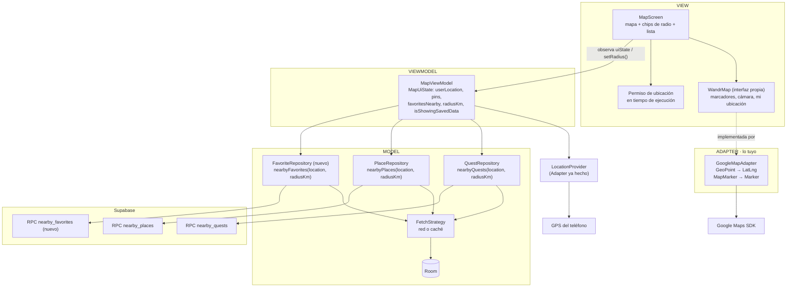

# Guía personal: Map / Nearby + BQ6 (Android)

Insumo de trabajo, no hace parte del entregable.

**Tu funcionalidad en una frase:** una pantalla de mapa que muestra dónde estoy, las quests cercanas con su distancia, un filtro de radio y la respuesta a BQ6 (*¿cuáles de mis lugares o actividades favoritas están cerca de mí en este momento?*).

Con esto cubres cuatro requisitos del sprint: sensor (GPS), contexto (ubicación), servicio externo (mapas y backend) y una BQ tipo 2. Tu patrón es **Adapter**.

## Antes de empezar

1. **Login funcionando.** Sin sesión, el backend rechaza todas las consultas. Falta correr en Supabase el `update auth.users…` de los tokens y revisar que `local.properties` de la copia que abres en Android Studio tenga `SUPABASE_URL` y `SUPABASE_PUBLISHABLE_KEY`.
2. **API key de Google Maps.** Se crea en Google Cloud Console (Maps SDK for Android). Va en `local.properties` como `MAPS_API_KEY`, nunca en Git.

## Qué ya existe y qué te falta

| Tarea | Ya existe | Te falta |
| --- | --- | --- |
| **GET /quests/nearby** | Todo el camino: RPC `nearby_quests` → `QuestRemoteDataSource.nearbyQuests()` → `NearbyQuestDto` → `QuestEntity` (Room) → `QuestDao.observeNearby(radius)` → `QuestRepository.nearbyQuests(location, radiusKm, policy)` | Nada en datos. Solo usarlo desde tu ViewModel |
| **Distancia** | `Quest.distanceKm` viene calculada por el backend y ordenada de menor a mayor | Mostrarla ("0.4 km") |
| **Ubicación actual** | `LocationProvider.currentLocation()` y `locationUpdates()` en `core/location/`. Los permisos están declarados en el Manifest | Pedir el permiso en tiempo de ejecución desde la pantalla, y dibujar el punto azul |
| **Filtro de radio** | `QuestRepository.nearbyQuests()` recibe `radiusKm`. `MapViewModel.setRadius()` existe | Los controles en pantalla (chips 1 / 3 / 5 / 10 km o un slider) |
| **Pantalla Map / Nearby** | `MapViewModel` y `MapUiState` (hoy cargan *lugares*, no quests). Componentes: `WandrTopBar`, `WandrBottomBar`, `SearchField`, `WandrChip`, `QuestRow`, `AvatarStack` | `MapScreen.kt` (Route + Screen), la ruta en `WandrNavHost`, y adaptar el ViewModel para quests |
| **Servicio de mapas** | Nada | Dependencia Maps Compose, la API key en el Manifest |
| **Adapter Pattern** | Un ejemplo ya hecho del mismo patrón: `LocationProvider` (interfaz propia) + `FusedLocationProvider` (adapta la API de Google) | El adapter del mapa (ver abajo) |
| **BQ6** | Nada: el backend no tiene el concepto de "favorito" | Todo: SQL, DTO, data source, repositorio, ViewModel, UI |
| **Pruebas de integración BQ6** | Dos ejemplos para copiar el estilo: `SupabaseReadOnlySmokeTest` (JVM) y `SupabaseIntegrationTest` (androidTest) | El test de BQ6 |

## Un detalle que te va a bloquear si no lo sabes

`nearby_quests` **no devuelve coordenadas**, solo `place_id`, `place_name` y `distance_km`. Sin latitud y longitud no puedes poner pines. Tienes dos salidas:

- **Sin tocar el backend (recomendada):** en el ViewModel combinas `QuestRepository.nearbyQuests()` con `PlaceRepository.nearbyPlaces()` (que sí trae `location`) usando `quest.placeId == place.id`. Ambos repositorios ya existen.
- **Tocando el backend:** agregar `latitude` y `longitude` al `returns table` de `nearby_quests` y a `NearbyQuestDto`, `QuestEntity` y `Quest`. Es más limpio, pero cambia el contrato que también usa iOS y obliga a subir la versión de Room.

## Cómo se conecta todo

Cómo leerlo:
- La pantalla nunca importa clases de Google Maps. Solo conoce `WandrMap` y tus modelos (`GeoPoint`, `MapMarker`).
- El ViewModel pide la ubicación, luego pide quests, lugares y favoritos con ese punto y el radio, y arma los pines.
- Cuando el usuario cambia el radio, el ViewModel vuelve a pedir todo. Sin conexión, la estrategia devuelve lo guardado en Room y la pantalla muestra el aviso.

## Paso a paso sugerido

### 1. Pantalla con lista, sin mapa todavía
Así validas datos y permisos antes de meter el SDK de mapas.
- Adapta `MapViewModel` para cargar quests (hoy carga lugares): estado con `quests`, `radiusKm`, `userLocation`, `isShowingSavedData`.
- Crea `ui/feature/map/MapScreen.kt` con `MapRoute` + `MapScreen`, igual que `LoginScreen.kt`.
- Pide el permiso con `rememberLauncherForActivityResult(RequestMultiplePermissions())`. Al concederlo, llama `viewModel.refresh()`.
- Muestra la lista con `QuestRow` y la distancia. Si `userLocation.source` es `FALLBACK`, avisa que se usa el centro de Bogotá.
- Agrega la ruta en `WandrNavHost` (reemplaza el "Home coming soon" o agrega `MapDestination`).

### 2. Filtro de radio
- Fila de `WandrChip` (1, 3, 5, 10 km) que llama `viewModel.setRadius()`.

### 3. Adapter del mapa (tu patrón)
- Define **tu** contrato en `core/map/` o `ui/components/map/`:
  - `data class MapMarker(id, position: GeoPoint, title, subtitle, kind)` con `kind` = quest / favorito.
  - `interface WandrMap { @Composable fun Content(userLocation, markers, radiusKm, onMarkerClick, modifier) }`.
- Implementa `GoogleMapAdapter : WandrMap` con Maps Compose (`GoogleMap`, `Marker`, `Circle` para el radio). Es el único archivo que importa `com.google.maps`.
- Entrégalo con Hilt (`@Binds`), como se hace con `LocationProvider` en `core/di/AppModule.kt`.
- Dependencias: `com.google.maps.android:maps-compose` y `play-services-maps`. En el Manifest: `<meta-data android:name="com.google.android.geo.API_KEY" android:value="${MAPS_API_KEY}"/>`, con `manifestPlaceholders` leído de `local.properties` (mira cómo se leen las claves de Supabase en `app/build.gradle.kts`).
- **Para la sustentación:** el Adapter convierte la interfaz de Google (LatLng, Marker, CameraPosition) en la que la app espera (GeoPoint, MapMarker). Si mañana cambian a MapLibre, solo se escribe otro adapter.

### 4. BQ6 de punta a punta
Primero hay que decidir **qué es un favorito**, porque el backend no lo tiene. En el Sprint 1 se definió como "guardado o visitado más de 2 veces". Opciones:
- **Mínima:** favorito = lugar donde completé 2 o más quests. No necesita tabla nueva.
- **Completa:** además una tabla `favorite_places(user_id, place_id)` para guardar a mano.

Acuérdalo con el equipo, porque iOS debe usar la misma definición. Luego, en este orden:
1. **Backend** (`rpc_functions.sql`): función `nearby_favorites(p_lat, p_lng, p_radius_km)` que devuelve los lugares favoritos del usuario dentro del radio, con `distance_km`. Puedes basarte en `nearby_places`.
2. **DTO**: reutiliza `PlaceDto` si devuelves las mismas columnas.
3. **Data source**: método en `PlaceRemoteDataSource` (copia `nearbyPlaces`).
4. **Repositorio**: `FavoriteRepository` nuevo, o un método en `PlaceRepository`. Regístralo en `RepositoryModule`.
5. **ViewModel**: `favoritesNearby` en `MapUiState`.
6. **UI**: pines con otro color y una sección "Tus favoritos cerca".
7. Verifica los datos de prueba: que Valentina tenga favoritos según la definición elegida.

Como BQ6 es tipo 2, su respuesta se muestra al usuario dentro de la app. Confirma con el equipo cómo aparece en el diagrama del pipeline de analítica.

### 5. Pruebas
- **Integración BQ6** (estilo `SupabaseReadOnlySmokeTest`): login como Valentina, llamar `nearby_favorites` desde el centro de Bogotá con radio 5 km y comprobar que:
  - todos los resultados tienen `distance_km <= 5`;
  - vienen ordenados por distancia;
  - con un radio muy pequeño devuelve menos (o ninguno).
- **Unitaria del ViewModel** (estilo `SocialViewModelsTest`, test "map reloads places…"): con repositorios falsos, comprobar que cambiar el radio vuelve a consultar y que quests y lugares se combinan bien en pines.

## Qué debes poder explicar

- **Adapter:** por qué la pantalla no depende de Google Maps, y que `LocationProvider` aplica la misma idea para la ubicación.
- **MVVM:** `MapScreen` solo dibuja `MapUiState`; `MapViewModel` decide qué pedir.
- **Repository + Strategy:** por qué el mapa muestra datos guardados cuando no hay conexión.
- **Sensor y contexto:** el GPS determina qué se muestra, y hay un plan B si no hay permiso o señal (última ubicación conocida, luego centro de Bogotá).
- **BQ6:** la definición de favorito, la consulta SQL y por qué es tipo 2.
